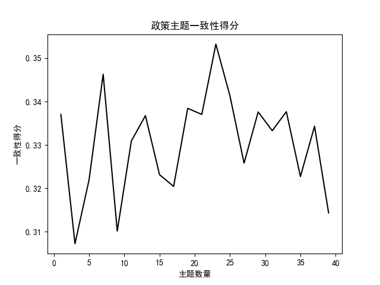
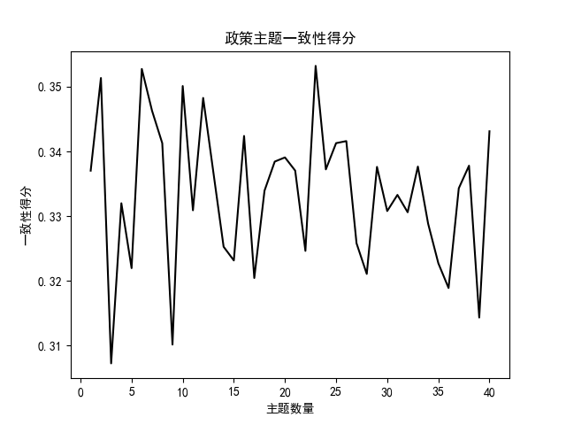
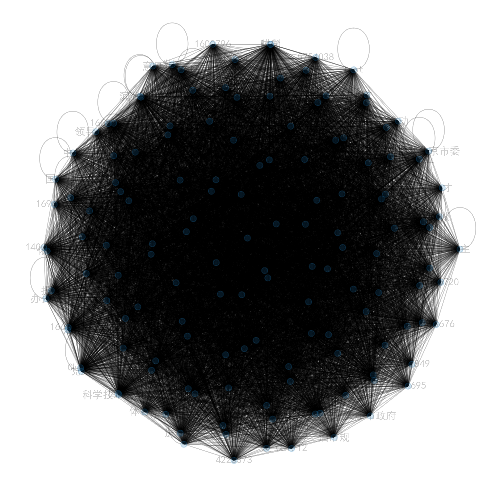
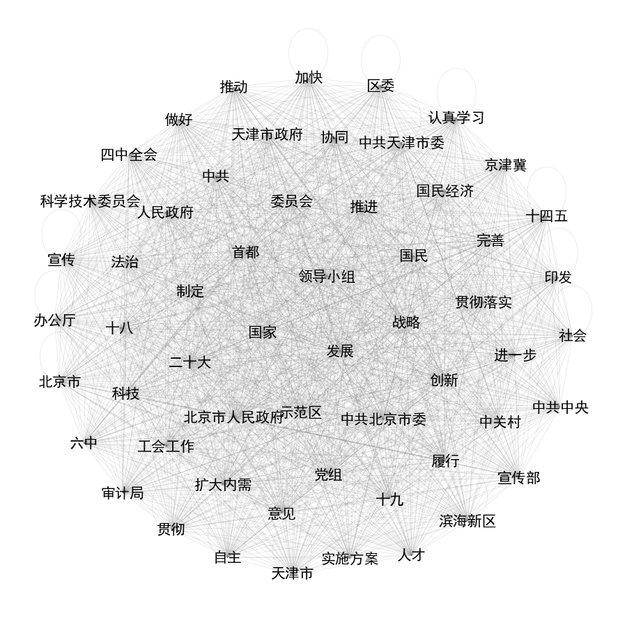

# policy_analysis

#### 项目表述

- 京津政策分析

#### 项目文件
```
policy_analysis
├─data
│  └─txt // 政策文件，自己下
├─paper // 论文pdf转doc
│  ├─doc // doc论文
│  └─pdf // pdf论文
├─result //共现语义图
├─stopwords // 停用词列表
└─util //mysql工具类
```
代码就自己看吧，有注释

### 运行
```
conda create -n policy python=3.10.14
conda activate policy
pip install -r requirements.txt
pip install -i https://pypi.tuna.tsinghua.edu.cn/simple -r requirements.txt
```

### 结果图

- 一致性得分原图

- 一致性得分处理图

- 共现语义图原图

- 共现语义图处理图  
 

### 联系方式(有偿咨询)
- QQ:284190056
- Wechat：AirEliauk9527